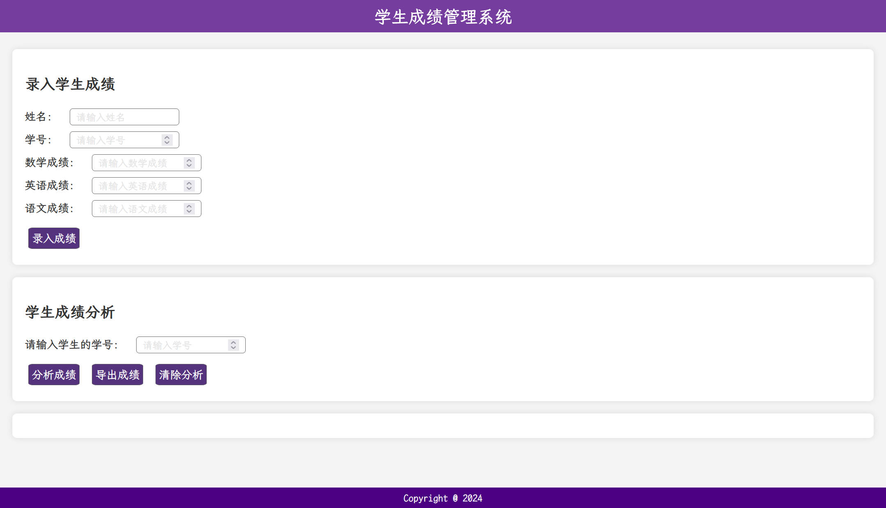
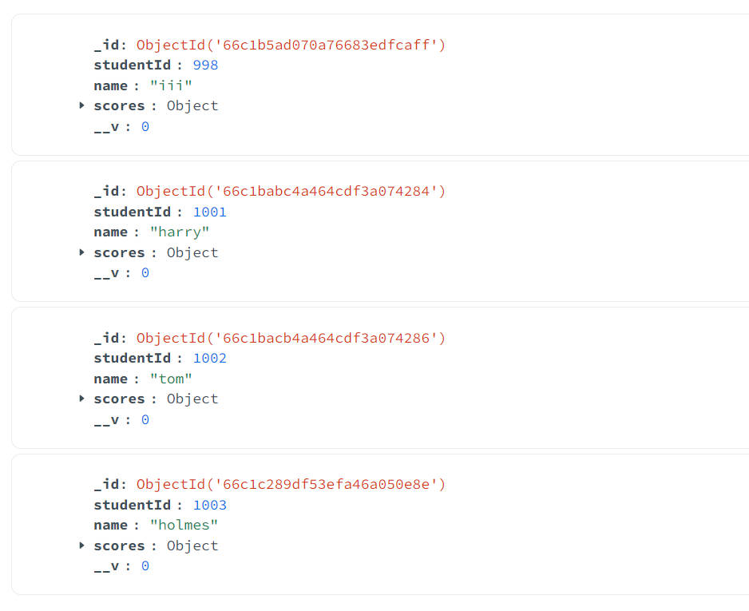

# 成绩查询系统

 “成绩管理系统” 的前端+后端。前端采用`html+css+js`，后端采用 Express 构建，要负责响应前端的请求，包括录入信息、查询成绩、导出成绩等（通过按钮实现），并使用 MongoDB 数据库管理学生成绩数据。

本项目在Windows 11系统测试无误。

## 运行方式

首先根据`package.json`安装相关依赖，并启动MongoDB服务，然后运行如下命令：

```bash
npm run start
```

当终端输出下列信息时，说明项目已顺利启动：

```
> hw18@1.0.0 start
> node server.js

Server running on port 3000
```

此时，打开浏览器，输入：`http://localhost:3000/` 即可打开网页界面，如下图所示：




## 主要功能介绍

- 录入成绩：输入学生姓名、学号、数学成绩、语文成绩、英语成绩后，点击“录入成绩”按钮，即可录入一个学生的成绩信息；学生成绩信息存储在MongoDB数据库中，如下图所示：

  

- 分析成绩：输入学生学号，点击”分析成绩“按钮，即可查看对应学号的学生的成绩信息；若学号不存在于数据库，则显示文字”查无此人“
- 导出成绩：点击”导出成绩“按钮，则将数据库目前已有的学生成绩信息导出为CSV文件，可以用Excel软件正常查看
- 清除分析：点击”清除分析“按钮，可清除已有的成绩分析内容